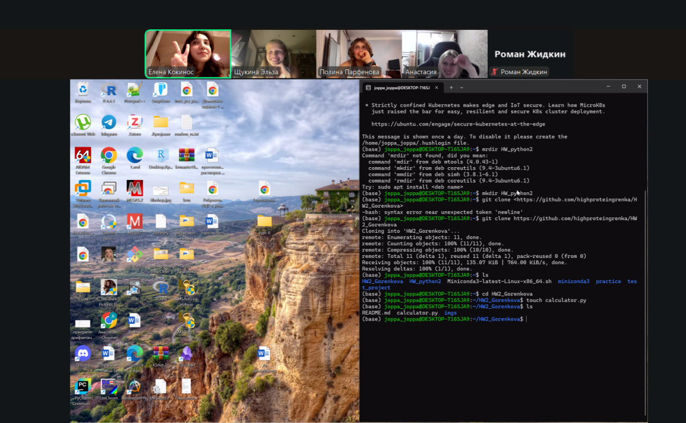

# Mathematical Expression Calculator

This is a simple Python console program that calculates mathematical expressions with two operands. It accepts a string as input, which contains a mathematical expression with two numbers (integers or floats) and one of the four operators (+, -, \*, /). The program then calculates the result and displays it on the screen.

### *Features*
___
- Supports four basic arithmetic operations (+, -, \* , /)
- Handles both integers and floats
- Checks for division by zero errors
- Provides error handling for invalid input
### *Requirements*
___
- Python 3.6 or later
### *To install*
___
- Clone the repository or download the zip file
- Make sure Python 3 is installed on your machine
#### *Developed by*
___
- Gorenkova Anastasiia  
- Kokinos Elena  
- Parfenova Polina  
- Shchukina Elza  
- Zhidkin Roman
 
